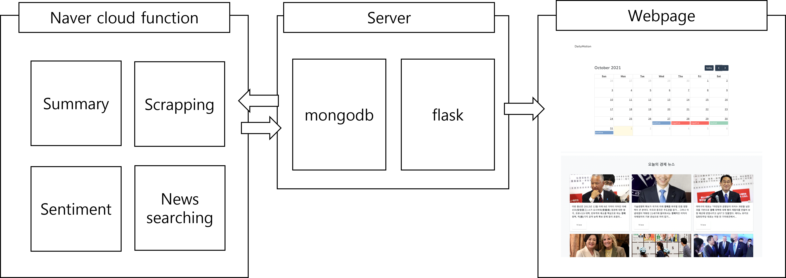
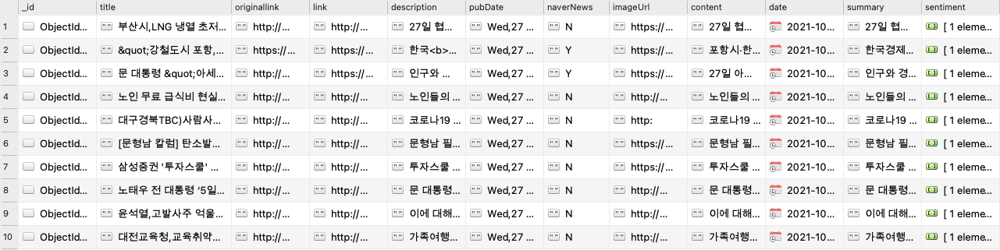
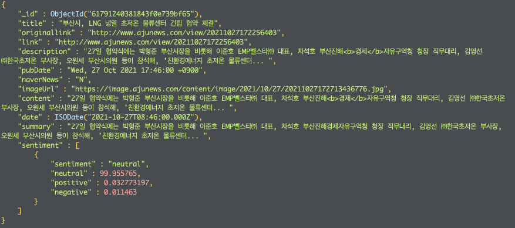
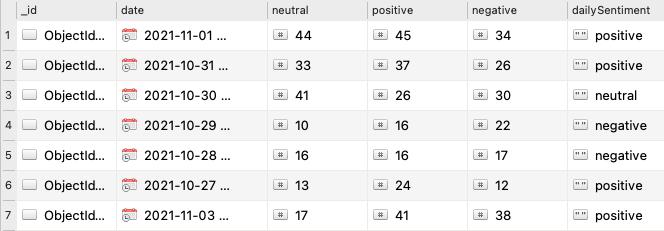
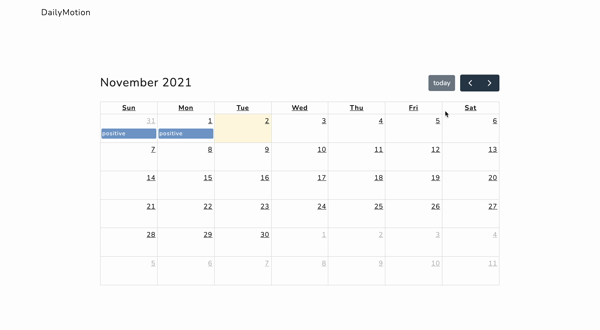
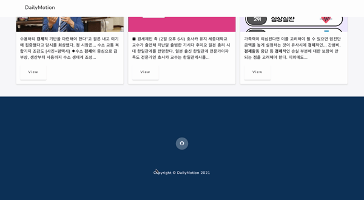

# DailyMotion


## 1. DailyMotion 이란

Daily + Emotion 이라는 의미로 하루하루 경제, 주식 키워드에 관련된 뉴스의 sentiment 분석을 통해 하루하루의 경제의 Sentiment를 달력에 뉴스와 함께 보여준다. 경제/주식 관련 뉴스들의 전반적인 동향을 살피는데 도움을 주기 위해 만들어진 웹 서비스다.

> **Project Duration** : 2021.10.24 ~ 2021.11.02

> **Server renewal Duration** : 2021.11.10 ~ 진행중

## 2. 구성



## 3. 서버

- Naver Cloud Flatform 에서 서버를 대여하여 사용
  - [Naver Cloud Server](https://www.ncloud.com/product/compute/server)
- Micro server / ubuntu-18.04 / 2vCPU, 4GB Mem, 50GB Disk
- MongoDB 를 사용하여 데이터 관리
- Flask 를 사용한 웹 서버

## 4. 데이터 수집 / 가공

- Naver 에서 제공하는 API 를 사용하여 데이터를 수집하고 가공한다.
- Scrapping 하여 데이터를 수집한다.
- NaverCloudFunction 을 사용하여 서버의 DB 에 원격 접속하여 수집한 데이터를 저장한다.
  - [Naver Cloud Function ](https://www.ncloud.com/product/compute/cloudFunctions)




### 1. 뉴스 수집

- Naver News API 사용
  - [Naver News API](https://developers.naver.com/docs/serviceapi/search/news/news.md)
- [ title, originallink, link, description, pubDate ] 수집

```python
 news_items = []

    for keyword in keywords:
        url = 'https://openapi.naver.com/v1/search/news.json'

        sort = 'date'
        start_num = 1

        params = {'display': display_num, 'start': start_num,
                  'query': keyword.encode('utf-8'), 'sort': sort}
        headers = {'X-Naver-Client-Id': client_id,
                   'X-Naver-Client-Secret': client_secret, }

        r = requests.get(url, headers=headers,  params=params)

        if r.status_code == requests.codes.ok:
            result_response = json.loads(r.content.decode('utf-8'))

            result = result_response['items']
            for item in result:
                originallink = item['originallink']
                link = item['link']

                if originallink == link:
                    item['naverNews'] = 'N'
                else:
                    item['naverNews'] = 'Y'

                item['imageUrl'] = scrape_image_url(link)

                if item['naverNews'] == 'Y':
                    content = scrape_content(link)
                    item['content'] = content if content != '' else item['description']
                else:
                    item['content'] = item['description']
```

소스코드 [링크](https://github.com/inwookie/naver-cloud-hackathon/blob/main/news_compile/__main__.py)

### 2. 뉴스 본문 내용 수집

- 수집한 URL 을 통해 뉴스의 본문을 수집한다.
- Summary 를 하기 위한 본문 수집

```python
    content = ''
    headers = {
        'User-Agent': 'Mozilla/5.0 (Windows NT 10.0; Win64; x64)AppleWebKit/537.36 (KHTML, like Gecko) Chrome/73.0.3683.86 Safari/537.36'}

    try:
        data = requests.get(url, headers=headers)
    except SSLError as e:
        data = requests.get(url, headers=headers, verify=False)

    soup = BeautifulSoup(data.text, 'html.parser')
    content = ''

    if 'news.naver.com' in url:
        naver_content = soup.select_one(
            '#articeBody') or soup.select_one('#articleBodyContents')

        if not naver_content:
            return content

        for tag in naver_content(['div', 'span', 'p', 'br', 'script']):
            tag.decompose()
        content = naver_content.text.strip()
```

소스코드 [링크](https://github.com/inwookie/naver-cloud-hackathon/blob/main/news_compile/__main__.py)

### 3. Summary

- Clova Summary API 를 사용하여 뉴스 본문을 요약 한다.
  - [Clova Summary API](https://www.ncloud.com/product/aiService/clovaSummary)
- Sentiment 분석 API 인 Clova Sentiment API 를 사용하기 위해서는 글자 수 제한이 1000자 이기 때문에 본문을 1000자 이하로 요약할 필요가 있다.

```python
    collection.update_many({'date': {'$exists': False}}, [
        {'$set': {'date': {"$toDate": "$pubDate"}}}])

    target_date = cal_datetime_utc(before_date)

    summary_items = list(collection.find(
        {'summary': {'$exists': False}, 'date': {'$gte': target_date['date_st'], '$lte': target_date['date_end']}}, {'_id': False}))

    for item in summary_items:
        if 200 < len(item['content']) < 2000:
            result = summary(txt=item['content'], client_id=summary_api_info['client_id'],
                             client_secret=summary_api_info['client_secret']).replace('</b>', "").replace('<b>', "") or item['description'].replace('</b>', "").replace('<b>', "")
        else:
            result = item['description'].replace(
                '</b>', "").replace('<b>', "")
```

```python
    headers = {'X-NCP-APIGW-API-KEY-ID': client_id,
               'X-NCP-APIGW-API-KEY': client_secret,
               'Content-Type': 'application/json'}

    document = {'content': txt}
    option = {'language': 'ko', 'model': 'news', 'tone': 0, 'summaryCount': 9}

    data = {'document': document, 'option': option}

    r = requests.post('https://naveropenapi.apigw.ntruss.com/text-summary/v1/summarize',
                      headers=headers, data=json.dumps(data))

    summary_txt = ''
    if r.status_code == requests.codes.ok:
        result_response = json.loads(r.content)
        summary_txt = result_response['summary']
```

소스코드 [링크](https://github.com/inwookie/naver-cloud-hackathon/blob/main/news_summary/__main__.py)

### 4. Sentiment 분석

- Clova sentiment api를 사용하여 summary한 내용으로 해당 기사의 sentiment를 분석한다.
  - [Clova Sentiment API](https://www.ncloud.com/product/aiService/clovaSentiment)

```python
    sentiment_items = list(collection.find(
        {'sentiment': {'$exists': False}, 'date': {'$gte': target_date['date_st'], '$lte': target_date['date_end']}}, {'_id': False}))

    for item in sentiment_items:
        if len(item['summary']) < 1000:
            result = sentiment(txt=item['summary'], client_id=sentiment_api_info['client_id'],
                               client_secret=sentiment_api_info['client_secret'])
        else:
            result = 'null'
```

```python
    sentiment_items = []

    if r.status_code == requests.codes.ok:
        result_response = json.loads(r.content)

        j = {
            'sentiment': result_response['document']['sentiment'],
            'neutral': result_response['document']['confidence']['neutral'],
            'positive': result_response['document']['confidence']['positive'],
            'negative': result_response['document']['confidence']['negative'],
        }
        sentiment_items.append(j)
```

소스코드 [링크](https://github.com/inwookie/naver-cloud-hackathon/blob/main/news_sentiment/__main__.py)

### 5. Daily Sentiment DB Collection 만들기

- Flask Web App 에 하루하루의 경제/주식 동향을 올리기 위해서는 당일 뉴스들의 sentiment 를 모아서 그날의 최종 동향을 구하고 저장하는 Collection 을 만들고 업데이트 해야한다.

```python
    target_date = cal_datetime(before_date)
    sentiment_items = list(collection.find(
        {'date': {'$gte': target_date['date_st'], '$lte': target_date['date_end']}}, {'_id': False}))

    neutral = 0
    positive = 0
    negative = 0

    for item in sentiment_items:
        try:
            sentiment = item['sentiment'][0]['sentiment']
            if (sentiment == 'neutral'):
                neutral += 1
            elif (sentiment == 'positive'):
                positive += 1
            elif (sentiment == 'negative'):
                negative += 1
        except IndexError: 
            print('IndexError 에러 발생, exception처리완료')

    sentiment = [neutral, positive, negative]
    max_sentiment = max(sentiment)

    if (neutral == max_sentiment and positive == max_sentiment and negative == max_sentiment):
        daily_sentiment = 'neutral'
    elif (neutral == max_sentiment and positive == max_sentiment):
        daily_sentiment = 'positive'
    elif (neutral == max_sentiment and negative == max_sentiment):
        daily_sentiment = 'negative'
    elif (positive == max_sentiment and negative == max_sentiment):
        daily_sentiment = 'neutral'
    elif (neutral == max_sentiment):
        daily_sentiment = 'neutral'
    elif (negative == max_sentiment):
        daily_sentiment = 'negative'
    elif (positive == max_sentiment):
        daily_sentiment = 'positive'

    sentiment = {
        'date': target_date['date_end'].strftime('%Y-%m-%d'),
        'neutral': neutral,
        'positive': positive,
        'negative': negative,
        'dailySentiment': daily_sentiment
    }
    collection_new.delete_one({'date': target_date['date_end'].strftime('%Y-%m-%d')})
    collection_new.insert_one(sentiment)
```

소스코드 [링크](https://github.com/inwookie/naver-cloud-hackathon/blob/main/daily_sentiment/__main__.py)



## 5. Roadmap

**백엔드**

- [x] 서버 만들기 - Naver Cloud
- [x] 경제 뉴스 수집하기 - Naver News API
  - [x] Web Scrape
    - [x] URL Image
    - [x] 본문
  - [x] DB에 저장하기 - MongoDB
  - [x] Naver Cloud Function 만들기
- [x] 본문 요약하기 - Naver Summary API
  - [x] DB에 저장하기 - MongoDB
  - [x] Naver Cloud Function 만들기
- [x] Datetime 만들기 - Convert to UTC
- [x] Sentiment 분석하기 - Naver Sentiment API
  - [x] DB에 저장하기 - MongoDB
  - [x] Naver Cloud Function 만들기
- [x] 분석된 sentiment을 이용해서 당일 경제/주식 최종 동향 선별하기
  - [x] 새로운 Collection으로 DB에 업데이트 하기 - MongoDB
  - [x] Naver Cloud Function 만들기

**Frontend**

- [x] Flask Web App 만들기
  - [x] DB에서 뉴스 데이터 가지고 오기
  - [x] DB에서 sentiment 데이터 가지고 오기
  - [x] Fullcalendar 사용해서 달력 구현하기
  - [x] Implement Bootstrap v5.0
  - [x] Design web page using HTML/CSS/Javascript

**Release**

- [x] Domain 사기
- [x] FileZilla 사용해서 서버에 업로드 하기
- [x] 가상환경 구현하기

## 6. 데모

| Home                       | Calendar                       |
| -------------------------- | ------------------------------ |
|  |  |

| News                       | Contact                       |
| -------------------------- | ----------------------------- |
|  |  |

### Home


### Calendar



### News


### Contact


